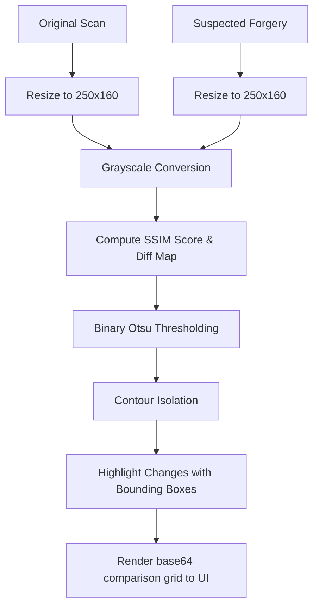

# 🔍 Image Integrity & Document Forgery Validator

This repository houses an automated computer vision framework designed to perform digital forensics and forgery detection on image documents (such as Permanent Account Number (PAN) cards). The system utilizes structural layout analysis, image thresholding, and contour isolation to highlight pixel-level differences between an original template and a suspected tampered image, calculating a Structural Similarity Index (SSIM) score to indicate authenticity.

---

## 🛠️ Project Structure & Sub-projects

The repository is structured into the following subdirectories:

1. **`collab-code/`**
   * Contains the development Jupyter Notebook [imageIntegrityValidator.ipynb](file:///home/arun/Documents/code/image-integrity-validator/collab-code/imageIntegrityValidator.ipynb) used for initial research, experimental design, and prototyping of the computer vision pipeline.

2. **`fastAPI-react-app/` (Recommended)**
   * A modern full-stack web application implementing the integrity validator.
   * **Backend**: Powered by [FastAPI](file:///home/arun/Documents/code/image-integrity-validator/fastAPI-react-app/backend/README.md) with OpenCV, Pillow, Scikit-Image, and SQLite.
   * **Frontend**: Built using [React (Vite + TypeScript)](file:///home/arun/Documents/code/image-integrity-validator/fastAPI-react-app/frontend/README.md) with an interactive dashboard, drag-and-drop file uploaders, and parallel comparative visualizations.

3. **`flask-app/`**
   * A lightweight [Flask prototype application](file:///home/arun/Documents/code/image-integrity-validator/flask-app/README.md) showing a basic HTML structure and server-side skeleton.

---

## 🧠 Core Computer Vision Pipeline



1. **Dimensions Standardisation**: Images are resized to `250x160` pixels using [PIL.Image.resize](file:///home/arun/Documents/code/image-integrity-validator/fastAPI-react-app/backend/app/services/detection_service.py#L72-L78) to ensure matching dimensions.
2. **Color Channel Reduction**: Converted to grayscale via [cv2.cvtColor](file:///home/arun/Documents/code/image-integrity-validator/fastAPI-react-app/backend/app/services/detection_service.py#L83-L86) to minimize noise and isolate structural layout components.
3. **Structural Similarity Index (SSIM)**: Evaluated using [skimage.metrics.structural_similarity](file:///home/arun/Documents/code/image-integrity-validator/fastAPI-react-app/backend/app/services/detection_service.py#L88-L92) to compute a score between `-1` and `1` (which we convert to a `0-100%` similarity score) representing structural layout match.
4. **Otsu's Thresholding**: Computes a binary threshold mask via [cv2.threshold](file:///home/arun/Documents/code/image-integrity-validator/fastAPI-react-app/backend/app/services/detection_service.py#L95-L97) to highlight strict disparities.
5. **Contour Extraction & Bounding Boxes**: Discovered contours are traced using [cv2.findContours](file:///home/arun/Documents/code/image-integrity-validator/fastAPI-react-app/backend/app/services/detection_service.py#L99-L102) and [imutils.grab_contours](file:///home/arun/Documents/code/image-integrity-validator/fastAPI-react-app/backend/app/services/detection_service.py#L102), plotting red bounding boxes on both scans where layouts diverge.

---

## ⚡ Quick Start

To run the main production app:

### 1. Backend Setup (FastAPI)
Navigate to [fastAPI-react-app/backend/](file:///home/arun/Documents/code/image-integrity-validator/fastAPI-react-app/backend):
```bash
python -m venv venv
source venv/bin/activate
pip install -r requirements.txt
uvicorn app.main:app --reload --port 8000
```

### 2. Frontend Setup (React)
Navigate to [fastAPI-react-app/frontend/](file:///home/arun/Documents/code/image-integrity-validator/fastAPI-react-app/frontend):
```bash
npm install
npm run dev
```
Open `http://localhost:5173` in your browser.

For further details on sub-projects, please check their respective README files:
* [Flask App README](file:///home/arun/Documents/code/image-integrity-validator/flask-app/README.md)
* [FastAPI + React README](file:///home/arun/Documents/code/image-integrity-validator/fastAPI-react-app/README.md)
* [Backend App README](file:///home/arun/Documents/code/image-integrity-validator/fastAPI-react-app/backend/README.md)
* [Frontend App README](file:///home/arun/Documents/code/image-integrity-validator/fastAPI-react-app/frontend/README.md)
